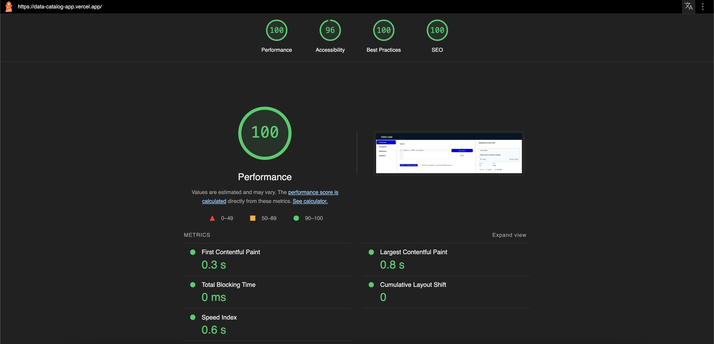

# Data-Land

## Project ummary

This project gives a brief overview about the table that is been loaded. The project has 4 tables:

- Customers
- Categories
- Employees
- Suppliers

Each table can be selected from the left side bar that displays the following information:

- Query Pane: This has a query text field along with run query button. This section also displays Data and the number of columns. It also consists of Readme section(tab). Readme allows to take notes by editing the existing description. It provides a good way to document notes/information related to table.
- Right Pane: This pane consists of information related to table such as:
  - Number of rows
  - Data size
  - Owners of the table
  - Short description
  - Tags
  - Tells if the table is verified or not
  - Comments from different users

## Libraries used:

- `@ant-design/icons` `antd`
- `@codemirror/lang-sql` `@uiw/react-codemirror`
- `dayjs`
- `papaparse`
- `react-markdown` `rehype-stringify`

## Performance:

The performance of the application was measured with Lighthouse with page load time of: `0.8s`

